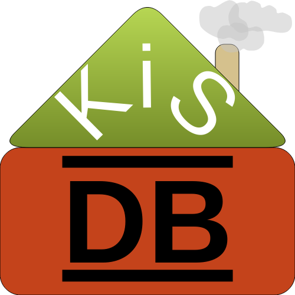
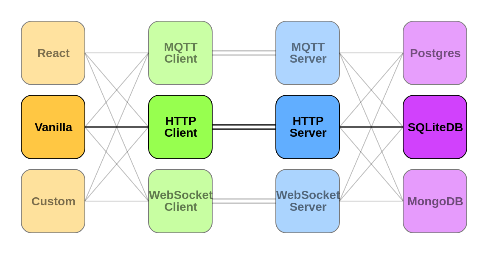

    

<h1 align="center"><b>KisDB</b></h1>

> [!WARNING]
> KisDB is a personal passion project reaslitically only meant for myself to use. It has plenty of cools features that others certainly could enjoy, so I putting it here, but certainly do NOT expect regular updates or any maintenance of any kind. Use at your own risk!

# **Introduction**
KisDB is a zero-dependency library that is highly modular and can serve as a schemaless, realtime Database and the primary API router for your small-scale personal project. It runs on Bun and can be interface-, protocol- and database-agnostic. The main goal is to have the simplest and most flexible Developer Experience possible, even if some performance/efficiency has to be sacrificed. Personal projects should be built to push your imagination and skills, not dance around dependencies' limitations.

# **Motivation**
I like building small, personal-use projects. I don't like designing and planning them. All Database/API solutions I could find were either DBaaS, lacked realtime-support or required fixed schemas that were difficult to constantly migrate during early development. I found myself having to first figure out the whole API & DB structure, decide on the tools that fit my needs best, get familiar with provided SDKs and then design my whole project around the tool's limitations. So instead of developing, I was just planning everything over and over again for each project. As one might think, this get's boring quite fast, so the projects ended up being abandoned before they really even began. No single Solution that I could find fit all my needs, so it was either deal with boring planning & repetitive design-work or abandon these kinds of projects I enjoy so much. So as any sane person would do; I chose to create KisDB :) 

# **Goals**

- __Realtime__
  - easily subscribe to get updates for any values
- __DX over Everything__
  - prioritize ease of use & flexibility instead of raw performance & efficiency
  - Built for small-scale personal projects, not enterprise-grade solutions
- __API Handling__
  - interact with and define the project's logical API through the same interface
  - no duplicate connections
  - no separate dataflows
- __Schemaless support__
  - DB & whole interface may never mandate a schema
  - schemas should of course be supported, but never required, only ever optional
  - Exponentially faster & easier early development
- __Client & Server__
  - simplify development for both the client and the server
  - no cumbersome duplicates of anything ever again
- __Local Support__
  - no cloud dependency
  - no lock-in to any service/company/product
- __No Dependencies__
  - one shouldn't need a hundred different npm-packages just create a simple client & database/backend
- __Any Data__
  - Must support Nested Objects, Key-Value-Pairs and Arrays/Lists
- __Any Protocol__
  - Allow for protocol-modules to handle transport in any way they see fit
  - REST (http/s), WebSocket, MQTT, raw tcp/udp, ...
- __Any Interface__
  - Allow flexible client interfaces (interoperable too):
  - Object-Oriented, Functional, VanillaJS, TypeScript, React, go, C/C++, ...

# **Overview**

KisDB consists of four module layers, each focused on their own responsibilities with no additional requirements.

## Viewer - Client
The viewer is what transform the primitive KCPHandle Object a client provides into an actual programmatic interface for the developer to use to access their data and API endpoints. Any viewer can be chosen and freely used with any client, the developer can even make their own without needing to consider any of the other KisDB layers; simplicity and modularity at it's core. This boundary is what enables KisDB to be interface-agnostic, allowing for a personalized Developer Experience.

## Client - Server
The Client and Server modules must always come in pairs. A single client module is only ever compatible and must explicitly be used with it's paired server module. They are responsible for transporting the data and requests. It does not matter how a server handles talking with it's client, the only requirement is that the server accepts a DB's KCPHandle and the client provides that KCPHandle to viewers. How they do it is completely irrelevant. This boundary is what enables KisDB to be protocol-agnostic, allowing wide hardware and programming language support.

## Server - Database
The Server module accepts a KCPHandle Object from the Database Module and communicates using it. The server is responsible for assigning unqiue connection-ID to each client or omit it if stateless. Any server can work with any Database, there is also nothing stopping you from using multiple server in parallel providing different protocols for the same database. Changes are automatically reflected at all servers through the database-module, nothing needs to be tracked, managed or coordinated by the servers; they merely 'serve'. This boundary is what enables the separation of the transport-layer and the data-layer, allowing any client using any protocol to seamlessly integrate with the same underlying Application Logic & Data as any other client using any other protocol. 

## Database - Storage
The Database module is responsible for interacting with the actual DB-instance. It provides the standardized KCPHandle Object and translates it locally via e.g. SQLite or remotely using available specific SDKs such as mongoose, S3 or any SQL-interface. The Database module is also responsible for implementating all authentication and authorization methods. Middleware-style solutions could have been implemented for more flexibility, however since many databases already implement varying degrees of auth and even perhaps even realtime listening, etc. extracting those into layers would have made everything more complicated, less efficient and much more prone to bugs. This way, only the DB module is considered 'trusted-context', everything else needs to authenticate itself (yes even the server needs a token, even if used locally)

# **Usage**
# **Examples**

# **API Reference**
## KCPHandle
> TODO: getter/setter/subber, KcpRawHandle, KcpTrustedHandle, Context
## Helpers
> TODO: metion & explain how to use all the various helpers to create your own viewer/client-server/db module (include auth in this section too and explain what paths it uses such as the 'auth.*' reserve and SUPERADMIN etc.)

> TODO: note that in future it is hoped to all multiple backend databases to be used, each for different data based on needs (similar to how auth reserves base-paths, so would this)

## **Notes on AI**
This project has **zero** AI-generated code or content of any kind. No agent, in-editor or project-context-aware AI was ever used for anything at all. Some microsnippets (~5 lines of code) might have come from AI. I still love to simply google (actually Brave/DDG) and look through Documentation/StackOverflow/Reddit but sometimes nothing comes up. Some tools or problems are too new, since AI noone sadly really posts solutions or problems on forums anymore. So my AI-philosophy is to use it as a modern-day search engine. The same way people would traditionally have used StackOverflow or Google Search (the old good one). I treat AI answers the same way I treat any zero-vote, zero-comment StackOverflow response: Cautiously optimistic. Modern-day search engines may have changed, my ways of using them and their content however have not. After all, even if one hard-headedly never interacts with AI themselves, there is no more way of knowing if any content on the internet came from an AI, a human, or simply a human using AI.